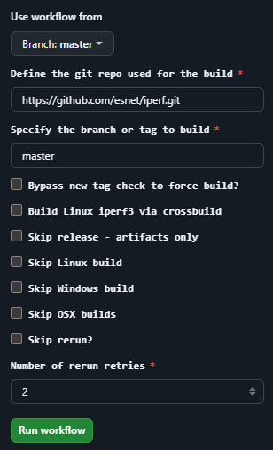

# iperf3 static builds

- iperf3 windows builds
- iperf3 linux builds
- iperf3 macosx builds

The only resource providing multiplatform distro independent iperf3 latest releases that has a 100% transparent build process from end to end. Complete accountability and verified chain of custody. No hidden parts.

- [Chain of custody and build provenance](https://github.com/userdocs/iperf3-static?tab=readme-ov-file#gh-attestation-verify) - easily verify the archive or binary was created here.
- [Transparent build process from source code to binary](https://github.com/userdocs/iperf3-static/actions) - source code > workflow > verification > release.
- [Virustotal scan and details during the build process](https://github.com/userdocs/iperf3-static?tab=readme-ov-file#gh-attestation-verify) - scanned before release.
- [Zizmor workflow auditing](https://github.com/woodruffw/zizmor) - helping ensure the worklow itself is not poisoned.
- Powerful build system with ability to specify repo and branches to easily build patches or custom builds.



## Build Platforms

- [Alpine linux](https://alpinelinux.org) edge using [qemu emulation](https://www.qemu.org)
- Windows on [Github Actions runners](https://github.com/actions/runner-images?tab=readme-ov-file#available-images) for x86_64 using a custom [Cywgin installer script](https://github.com/userdocs/iperf3-static/blob/master/cygwin-installer.cmd)
- MacOS on [Github Actions runners](https://github.com/actions/runner-images?tab=readme-ov-file#available-images) for amd64 (mmacos-13) and arm64 (macos-14) with static openssl and iperf libraries.

## Available architectures

Linux:

- Arch: `amd64` `arm32v6` `arm32v7` `arm64v8` `i386` `ppc64le` `riscv64` `s390x`
- Docker: yes
- Static binaries: yes
- Openssl latest release - https://github.com/openssl/openssl/releases/latest

Windows:

- Arch: `amd64`
- Docker: no
- Static binaries: yes
- Openssl 3.0.x LTS (2026-09-07) - LTS Releases after this don't work with cygwin / iperf3 for windows builds.

MacOS:

- Arch: `amd64` `arm64`
- Docker: no
- Static binaries: yes
- Openssl@3 - https://formulae.brew.sh/formula/openssl@3

> [!NOTE]
> Windows and MacOS binaries are not fully static in terms of their dependency and `cygwin1.dll` (Windows) `libSystem.B.dylib` (MasOS).
> They are statically linked with `libcrypo.a` `libssl.a` (openssl) and `iperf3.a` (iperf3) so there should be no other system dependency required to run them on the target hosts.
>
> On Windows openssl is built from Github source to get static libs and on MacOS we get them from the brew cellar installation of `openssl@3`

## Download - Static Binaries

Static binaries for Linux and Windows are available here: https://github.com/userdocs/iperf3-static/releases/latest

Example:

```
curl -sLo- iperf3 https://github.com/userdocs/iperf3-static/releases/latest/download/iperf3-amd64
chmod +x iperf3
iperf3 --version
```

## Download - Docker

Multiarch Docker images are available via https://github.com/users/userdocs/packages/container/package/iperf3-static

Example:

```bash
docker pull ghcr.io/userdocs/iperf3-static:latest
```

To used the image dynamically

```bash
docker run -it ghcr.io/userdocs/iperf3-static:latest iperf3 --version
```

## Alpine multiarch info

<details closed>
<summary>Expand for details</summary>

| Alpine Arch | Docker platform arch |         Source of Build Dockers         |    ghcr.io image    |
| :---------: | :------------------: | :-------------------------------------: | :-----------------: |
|    armhf    |     linux/arm/v6     | https://hub.docker.com/r/arm32v6/alpine | arm32v6/alpine:edge |
|    armv7    |     linux/arm/v7     | https://hub.docker.com/r/arm32v7/alpine | arm32v7/alpine:edge |
|   aarch64   |     linux/arm64      | https://hub.docker.com/r/arm64v8/alpine | arm64v8/alpine:edge |
|   ppc64le   |    linux/ppc64le     | https://hub.docker.com/r/ppc64le/alpine | ppc64le/alpine:edge |
|    s390x    |     linux/s390x      |  https://hub.docker.com/r/s390x/alpine  |  s390x/alpine:edge  |
|   riscv64   |    linux/riscv64     | https://hub.docker.com/r/riscv64/alpine | riscv64/alpine:edge |
|     x86     |      linux/i386      |  https://hub.docker.com/r/i386/alpine   |  i386/alpine:edge   |
|   x86_64    |     linux/amd64      |  https://hub.docker.com/r/amd64/alpine  |  amd64/alpine:edge  |

</details>

## Windows x86_64 info

<details closed>
<summary>Expand for details</summary>

Static Cygwin builds created via cygwin64 using this custom installer

https://github.com/userdocs/iperf3-static/blob/master/cygwin-installer.cmd

</details>

## Generic Build dependencies

<details closed>
<summary>Expand for details</summary>

```
apk add build-base pkgconf autoconf automake curl libtool git perl openssl-libs-static openssl-dev linux-headers
```

#### Debian linux

```
apt install -y build-essential pkg-config automake libtool libssl-dev git perl
```

#### Cygwin packages

Without openssl

```bash
automake,gcc-core,gcc-g++,git,libtool,make,pkg-config
```

With openssl

```bash
automake,gcc-core,gcc-g++,git,libtool,make,pkg-config,libssl-devel,zlib-devel
```

### Generic Build Instructions

Clone the git repo - linux + Cygwin

```bash
git clone https://github.com/esnet/iperf.git ~/iperf3 && cd ~/iperf3
```

Bootstrap - If you cloned the repo

```bash
./bootstrap.sh
```

Configure - linux + Cygwin

Note: Cygwin requires requires compiling openssl and zlib static libs to link statically. Otherwise you compile dynamically

Static

```bash
./configure --disable-shared --enable-static-bin --prefix=$HOME
```

Dynamic

```bash
./configure --prefix=$HOME
```

Cygwin openssl requires compiling openssl and zlib

Build - linux + Cygwin

```
make -j$(nproc)
make install
```

### Check the linking was done properly

```
ldd ~/bin/iperf3
```

### Version

Use this command to check the version.

```
~/bin/iperf3 -v
```

Will show something like this.

```
iperf 3.10.1 (cJSON 1.7.13)
Optional features available: CPU affinity setting, IPv6 flow label, TCP congestion algorithm setting, sendfile / zerocopy, socket pacing, authentication, bind to device, support IPv4 don't fragment
```

### Use the static binaries from this repo

Download and install to the bin directory of your local user (for root this may not be in the `$PATH`)

Pick the platform URL you need:

i386 / x86

```bash
mkdir -p ~/bin && source ~/.profile
wget -qO ~/bin/iperf3 https://github.com/userdocs/iperf3-static/releases/latest/download/iperf3-i386
chmod 700 ~/bin/iperf3
```

amd64

```bash
mkdir -p ~/bin && source ~/.profile
wget -qO ~/bin/iperf3 https://github.com/userdocs/iperf3-static/releases/latest/download/iperf3-amd64
chmod 700 ~/bin/iperf3
```

arm32v6

```bash
mkdir -p ~/bin && source ~/.profile
wget -qO ~/bin/iperf3 https://github.com/userdocs/iperf3-static/releases/latest/download/iperf3-arm32v6
chmod 700 ~/bin/iperf3
```

arm32v7

```bash
mkdir -p ~/bin && source ~/.profile
wget -qO ~/bin/iperf3 https://github.com/userdocs/iperf3-static/releases/latest/download/iperf3-arm32v7
chmod 700 ~/bin/iperf3
```

aarch64 / arm64

```bash
mkdir -p ~/bin && source ~/.profile
wget -qO ~/bin/iperf3 https://github.com/userdocs/iperf3-static/releases/latest/download/iperf3-arm64v8
chmod 700 ~/bin/iperf3
```

ppc64le

```bash
mkdir -p ~/bin && source ~/.profile
wget -qO ~/bin/iperf3 https://github.com/userdocs/iperf3-static/releases/latest/download/iperf3-ppc64le
chmod 700 ~/bin/iperf3
```

s390x

```bash
mkdir -p ~/bin && source ~/.profile
wget -qO ~/bin/iperf3 https://github.com/userdocs/iperf3-static/releases/latest/download/iperf3-s390x
chmod 700 ~/bin/iperf3
```

Windows builds required being bundled with Cygwin dlls to work so these are not single static binaries. They have a directory structure like this.

```
iperf3.exe
cygwin1.dll
```

Windows x64 no openssl

https://github.com/userdocs/iperf3-static/releases/latest/download/iperf3-amd64-win.zip

Windows x64 with openssl

https://github.com/userdocs/iperf3-static/releases/latest/download/iperf3-amd64-win-openssl.zip

Check the version:

```
~/bin/iperf3 -v
```

</details>

## MacOS amd64 and arm64 info

<details closed>
<summary>Expand for details</summary>

amd64 macos-13 intel

```bash
mkdir -p ~/bin && source ~/.profile
wget -qO ~/bin/iperf3 https://github.com/userdocs/iperf3-static/releases/latest/download/iperf3-amd64-osx-13
chmod 700 ~/bin/iperf3
```

arm64 macos-14 apple M1

```bash
mkdir -p ~/bin && source ~/.profile
wget -qO ~/bin/iperf3 https://github.com/userdocs/iperf3-static/releases/latest/download/iperf3-arm64-osx-14
chmod 700 ~/bin/iperf3
```

</details>

## gh attestation verify

<details closed>
<summary>Expand for details</summary>

Binaries built from the release of `3.17.1+` use [actions/attest-build-provenance](https://github.com/actions/attest-build-provenance)

Verify the integrity and provenance of an artifact using its associated cryptographically signed attestations.

https://cli.github.com/manual/gh_attestation_verify

For example:

```bash
gh attestation verify iperf3-amd64 -o userdocs
```

Will give you this result for the `release-5.0.0_v2.0.10` revision `1` binary.

```bash
Loaded digest sha256:84f9851d0647d3d618c66d64cac10ed1eb37583b3aaf3bb0baac88bf446fb10a for file://iperf3-amd64
Loaded 6 attestations from GitHub API
✓ Verification succeeded!

sha256:84f9851d0647d3d618c66d64cac10ed1eb37583b3aaf3bb0baac88bf446fb10a was attested by:
REPO                    PREDICATE_TYPE                  WORKFLOW
userdocs/iperf3-static  https://slsa.dev/provenance/v1  .github/workflows/alpine_multi.yml@refs/heads/master
```

</details>

## Virustotal scanning

<details closed>
<summary>Expand for details</summary>

All binaries and dlls are scanned by virus total and the results uploaded using this action

https://github.com/crazy-max/ghaction-virustotal

The results url is uploaded to the release body and you can see them here https://github.com/userdocs/iperf3-static/releases/latest

</details>

### Credits and acknowledgements

<details closed>
<summary>Expand for details</summary>

Other contributions have helped inspire the creation of a GitHub action for a Windows build and release.

[www.neowin.net](https://www.neowin.net/forum/topic/1234695-iperf-313-windows-build) via [budman](https://www.neowin.net/forum/profile/14624-budman/)

https://github.com/ar51an/iperf3-win-builds via [cryptanalyst](https://www.neowin.net/forum/profile/170754-cryptanalyst/)

</details>

## Forking and using this repo

<details closed>
<summary>Expand for details</summary>

Step 1: Fork the repo: https://github.com/userdocs/iperf3-static/fork

Step 2: Under the repo `/settings/secrets/actions` you will need to set a the `VT_API_KEY` using your

You can find it here if you have created an account: https://www.virustotal.com/gui/my-apikey

Step 3: Under the Actions tab, enable workflows. The `check_new_release.yml` defaults to a scheduled check but can be run manually.

https://github.com/userdocs/iperf3-static/blob/0571ce60cba18d2b67303b71d31009f83bae36c8/.github/workflows/check_new_release.yml#L11-L12

</details>

## Test Servers

https://github.com/R0GGER/public-iperf3-servers?tab=readme-ov-file#servers-per-continent

Linux one liner for an example output of `./iperf3 -c speedtest.ip-projects.de` for a random Europe server

```shell
./$(curl -sL https://db.iperf3serverlist.net/api/v1/db/public/shared-view/b111407c-43c4-48af-a828-301b698064a3/rows/export/csv | awk -F, 'NR>1 { print $1 }' | shuf -n1)
```
